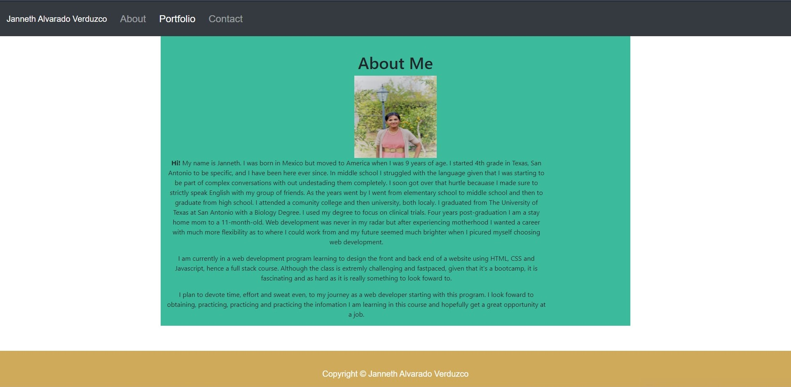

# Janneth Alvarado Verduzco Portfolio 

## Table of Contents

- [Description](#Description)
- [Contributors](#Contributors)
- [Language/Technoligies Used](#Language/Technologies-Used)
- [Mock-Up](#Mock-Up)
- [Repository](#Repository-Link)
- [Questions](#Questions)

## Description

My portfolio features previous projects. The projects vary in content but the basis of the technology used across these projects is HTML5, CSS, JavaScript, jQuery, NodeJS,, Sequelize, MongoDB and some use of API’s. There is a contact section where one can provide the required information to be contacted by me. There is also a section About Me where you can get to know a little about me.

## Contributors

[Janneth Alvarado Verduzco](https://github.com/jannverduzco) - janneth_verduzco@live.com

## Language/Technologies Used

- HTML5
- CSS
- Bootstrap (react)
- React
- JSX
- Heroku (Deployment)
- ESLint (Testing code)

## Display

## Deployed Link

https://janneth-alvarado-portfolio.herokuapp.com/

## GitHub Repository Link

https://github.com/jannverduzco/Portfolio

## Questions

Please contact me direclty at [janneth_verduzco@live.com](janneth_verduzco@live.com) with any questions or suggestions.
